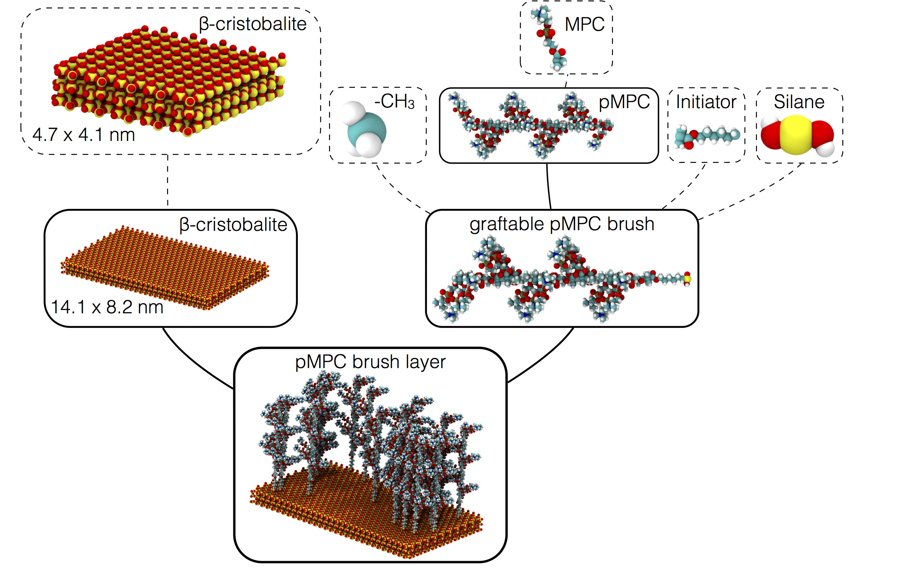

## mBuild: a hierarchical, component based molecule builder

[](https://travis-ci.org/mosdef-hub/mbuild)
[](https://ci.appveyor.com/project/ctk3b/mbuild-o0viu/branch/master)
[](https://pypi.python.org/pypi/mbuild)
[](https://anaconda.org/mosdef/mbuild)
[](https://coveralls.io/github/mosdef-hub/mbuild?branch=master)

With just a few lines of mBuild code, you can assemble reusable components into
complex molecular systems for molecular dynamics simulations.

* mBuild is designed to minimize or even eliminate the need to explicitly translate and
  orient components when building systems: you simply tell it to connect two
  pieces!
* mBuild keeps track of the system's topology so you don't have to
  worry about manually defining bonds when constructing chemically bonded
  structures from smaller components.

To learn more, get started or contribute, check out our [website](http://mosdef-hub.github.io/mbuild/).

If you use this package, please cite [our paper](http://dx.doi.org/10.1007/978-981-10-1128-3_5
). The BibTeX reference is
```
@article{Klein2016mBuild,
      author = "Klein, Christoph and Sallai, János and Jones, Trevor J. and Iacovella, Christopher R. and McCabe, Clare and Cummings, Peter T.",
      title = "A Hierarchical, Component Based Approach to Screening Properties of Soft Matter",
      booktitle = "Foundations of Molecular Modeling and Simulation",
      series = "Molecular Modeling and Simulation: Applications and Perspectives",
      year = "2016",
      doi = "http://dx.doi.org/10.1007/978-981-10-1128-3_5" 
}
```

#### Example system

*Additional interactive examples can be found here:* 

[](http://mybinder.org/repo/imodels/mbuild_binder)

Components in dashed boxes are drawn by hand using, e.g.,
[Avogadro](https://avogadro.cc/) or generated elsewhere. Each
component is wrapped as a simple python class with user defined attachment
sites, or ports. That's the "hard" part! Now mBuild can do the rest. Each component
further down the hierarchy is, again, a simple python class that describes
which piece should connect to which piece.

Ultimately, complex structures can be created with just a line or two
of code. Additionally, this approach seamlessly exposes tunable parameters within
the hierarchy so you can actually create whole families of structures simply
by adjusting a variable:

```python
import mbuild as mb
from mbuild.examples import PMPCLayer

pattern = mb.Random2DPattern(20)  # A random arrangement of 20 pieces on a 2D surface.
pmpc_layer = PMPCLayer(chain_length=20, pattern=pattern, tile_x=3, tile_y=2)
```




#### [](http://opensource.org/licenses/MIT)

Various sub-portions of this library may be independently distributed under
different licenses. See those files for their specific terms.

This material is based upon work supported by the National Science Foundation under grants NSF CBET-1028374 and NSF ACI-1047828. Any opinions, findings, and conclusions or recommendations expressed in this material are those of the author(s) and do not necessarily reflect the views of the National Science Foundation.
