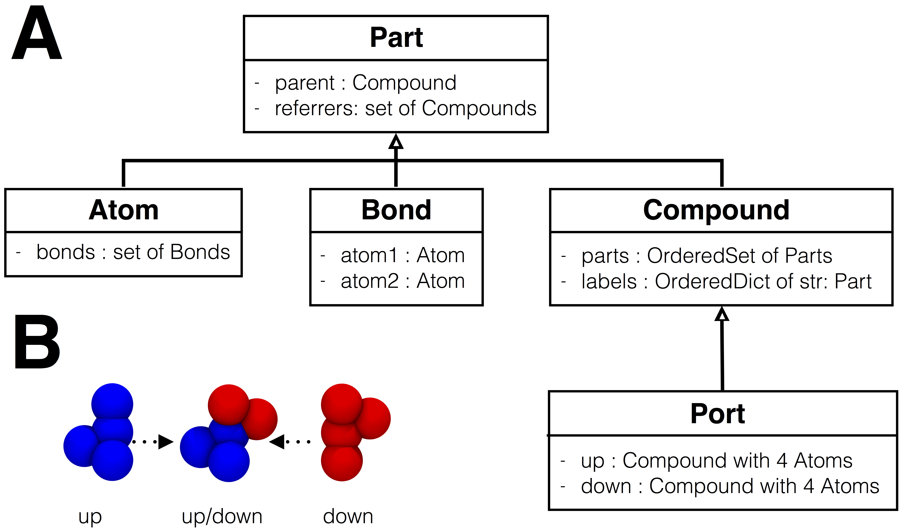

===============
Data Structures
===============

The core data structures of mBuild are illustrated below. The primary building
blocks in an mBuild hierarchy inherit from the ``Compound`` class.
``Compounds`` maintain an ordered set of ``Parts`` which can be other
``Compounds``, ``Atoms`` and ``Bonds``.  In addition, an independent, ordered
dictionary of ``labels`` is maintained through which users can reference any
other ``Part`` in the hierarchy via descriptive strings.  Every ``Part`` knows
its parent ``Compound``, one step up in the hierarchy, and knows which
``Compounds`` reference it in their ``labels``.  ``Ports`` are a special type
of ``Compound`` which are used internally to connect different ``Compounds``
using the equivalence transformations described below.

    **A)** The core data structures of mBuild. ``Atom``, Bond`` and
    ``Compound`` all inherit from ``Part`` and ``Ports`` are a special type of
    ``Compound`` which are typically only used internally but may also be
    output if desired.  **B)** The spatial arrangement of the atoms within
    a ``Port``.  Both ``up`` and ``down`` contain the same arrangement of four
    non-coplanar ``Atoms`` except that they face opposite directions.

Atom
----

.. autoclass:: mbuild.atom.Atom
    :members:

Bond
----

.. autoclass:: mbuild.bond.Bond
    :members:

Compound
--------

.. autoclass:: mbuild.compound.Compound
    :members:

Port
----

.. autoclass:: mbuild.port.Port
    :members:

Part
----

.. autoclass:: mbuild.part.Part
    :members:
