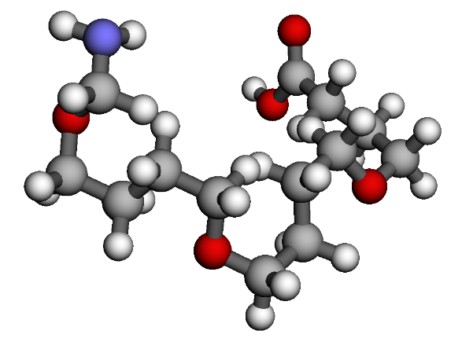

Polymer
========================

Use two (2) different monomer units, A and B, to construct a polymer, capping it with a carboxylic acid and amine end group.

Import the required mbuild packages.

.. code:: ipython

    import mbuild as mb
    from mbuild.lib.recipes.polymer import Polymer

Create the monomer units `comp_1` and `comp_2` using `SMILES strings <https://www.daylight.com/dayhtml/doc/theory/theory.smiles.html>`_.
Set the `chain` as a ``Polymer`` class, adding `comp_1` and `comp_2` as the monomers A and B to the polymer.

.. note::
    Setting the indices identifies which atoms will be removed and have ports created in their place.

.. code:: ipython

    comp_1 = mb.load('CC', smiles=True) # mBuild compound of the monomer unit
    comp_2 = mb.load('COC', smiles=True) # mBuild compound of the monomer unit
    chain = Polymer()
    chain.add_monomer(compound=comp_1,
                      indices=[2, -2],
                      separation=.15,
                      replace=True)

    chain.add_monomer(compound=comp_2,
                      indices=[3, -1],
                      separation=.15,
                      replace=True)

Select the carboxylic acid and amine end groups that we want to use for the head and tail of the polymer.
Then, build the polymer with three (3) iterations of the AB sequence, and the selected head and tail end groups.

.. code:: ipython

    chain.add_end_groups(mb.load('C(=O)O',smiles=True),
                         index=3,
                         separation=0.15,
                         duplicate=False,
		         label="head")

    chain.add_end_groups(mb.load('N', smiles=True),
                         index=-1,
		         separation=0.13,
                         duplicate=False,
		         label="tail")

    chain.build(n=3, sequence='AB')
    chain.visualize()

    This **example polymer** is 3 of the AB sequences together with carboxylic acid and amine end groups.
