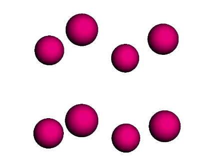
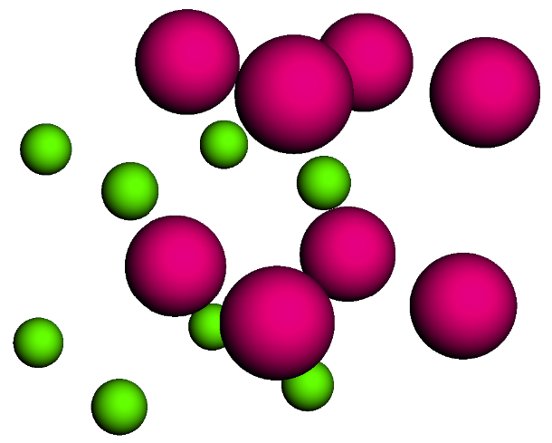
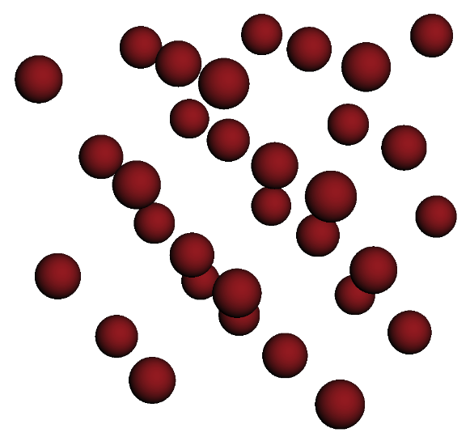
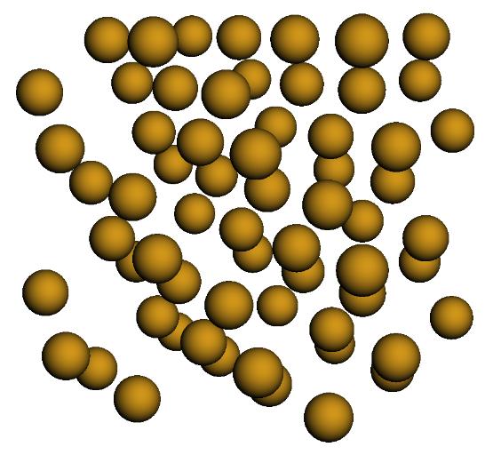
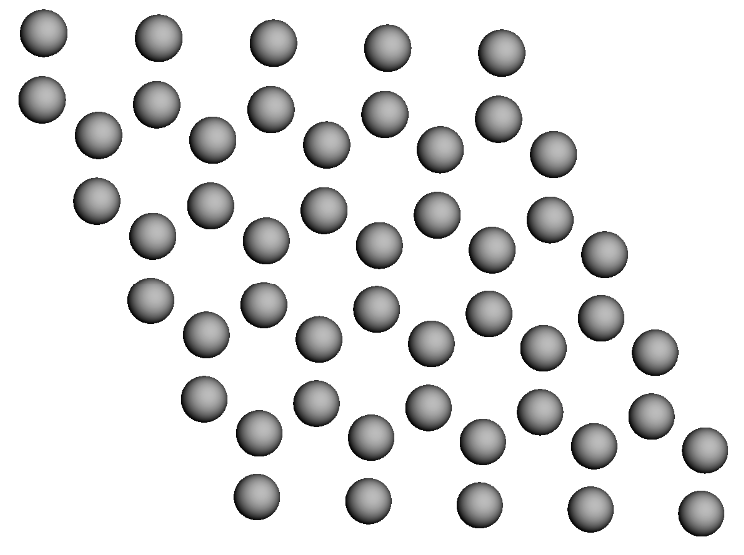

``Lattice`` Tutorial
====================

The following notebook provides a thorough walkthrough to using the
``Lattice`` class to build up crystal systems.

``Lattice`` Functionality
-------------------------

-  **Variable-dimension crystal structures**

   -  ``Lattice`` supports the dimensionality of ``mBuild``, which
      means that the systems can be in 1D, 2D, or 3D. Replace the
      necessary vector components with 0 to emulate the dimensionality
      of interest.

-  **Multicomponent crystals**

   -  ``Lattice`` can support an indefinite amount of lattice points in
      its data structure.

   -  The `repeat` cell can be as large as the user defines useful.

   -  The components that occupy the lattice points are ``mbuild.Compound`` objects.

      -  This allows the user to build any system since compounds are
         only a representation of matter in this design.
      -  Molecular crystals, coarse grained, atomic, even alloy crystal
         structures are all supported

-  **Triclinic Lattices**

   -  With full support for triclinic lattices, any crystal structure
      can technically be developed.
   -  Either the user can provide the lattice parameters, or if they
      know the vectors that span the unit cell, that can also be
      provided.

-  **Generation of lattice structure from crystallographic index file** `(CIF) <https://www.iucr.org/resources/cif/documentation>`_ **formats**

   -  Please also see the :ref:`QuickStart_Load_files` section for other ways to load files.

-  *IN PROGRESS* **Template recipes to generate common crystal
   structures (FCC, BCC, HEX, etc)**

   -  This is currently being developed and will be released relatively
      shortly
   -  To generate these structures currently, the user needs to know the
      lattice parameters or lattice vectors that define these units.

``Lattice`` Data Structure Introduction
---------------------------------------

Below we will explore the relevant data structures that are attributes
of the ``Lattice`` class. This information will be essential to build
desired crystal structures.

To begin, we will call the python ``help()`` method to observe the
parameters and attributes of the ``Lattice`` class.

.. code:: ipython

    import mbuild
    help(mbuild.Lattice)

As we can see, there are quite a few attributes and parameters that make
up this class. There are also a lot of inline examples as well. If you
ever get stuck, remember to use the python built-in ``help()`` method!

-  **Lattice.lattice_spacing**

   This data structure is a (3,) array that details the lengths of the
   repeat cell for the crystal. You can either use a ``numpy`` array
   object, or simply pass in a list and ``Lattice`` will handle the
   rest. Remember that ``mBuild``\ ’s units of length are in nanometers
   [nm]. You must pass in all three lengths, even if they are all
   equivalent. These are the lattice parameters :math:`a, b, c` when
   viewing crystallographic information.

   For Example:

   .. code:: ipython

       lattice_spacing = [0.5, 0.5, 0.5]

-  **Lattice.lattice_vectors**

   ``lattice_vectors`` is a 3x3 array that defines the vectors that
   encapsulate the repeat cell. This is an optional value that the user
   can pass in to define the cell. Either this must be passed in, or the
   3 Bravais angles of the cell from the lattice parameters must be
   provided. If neither is passed in, the default value are the vectors
   that encase a cubic lattice.

   .. note::
       Most users will **not** have to use these to build their
       lattice structure of interest. It will usually be easier for the
       users to provide the 3 Bravais angles instead. If the user then wants
       the vectors, the ``Lattice`` object will calculate them for the user.

   For example: Cubic Cell

   .. code:: ipython

       lattice_vectors = [[1, 0, 0], [0, 1, 0], [0, 0, 1]]

-  **Lattice.angles**

   ``angles`` is a (3,) array that defines the three Bravais angles of
   the lattice. Commonly referred to as :math:`\alpha, \beta, \gamma` in
   the definition of the lattice parameters.

   For example: Cubic Cell

   .. code:: ipython

       angles = [90, 90, 90]

-  **Lattice.lattice_points**

   ``lattice_points`` can be the most common source of confusion when
   creating a crystal structure. In crystallographic terms, this is the
   minimum basis set of points in space that define where the points in
   the lattice exist. This requires that the user does not over define
   the system.

   .. note::
       MIT's OpenCourseWare has an excellent PDF for more information
       `here <https://ocw.mit.edu/courses/earth-atmospheric-and-planetary-sciences/12-108-structure-of-earth-materials-fall-2004/lecture-notes/lec7.pdf>`_

   The other tricky issue that can come up is the data structure itself.
   ``lattice_points`` is a dictionary where the ``dict.key`` items are
   the ``string`` id’s for each basis point. The ``dict.values`` items
   are a nested list of fractional coordinates of the unique lattice
   points in the cell. If you have the same ``Compound`` at multiple
   lattice_points, it is easier to put all those coordinates in a nested
   list under the same ``key`` value. Two examples will be given below,
   both FCC unit cells, one with all the same id, and one with unique
   ids for each lattice_point.

   For Example: FCC All Unique

   .. code:: ipython

       lattice_points = {'A' : [[0, 0, 0]],
                         'B' : [[0.5, 0.5, 0]],
                         'C' : [[0.5, 0, 0.5]],
                         'D' : [[0, 0.5, 0.5]]
                         }

   For Example: FCC All Same

   .. code:: ipython

       lattice_points = {'A' : [[0, 0, 0], [0.5, 0.5, 0], [0.5, 0, 0.5], [0, 0.5, 0.5]] }

``Lattice`` Public Methods
--------------------------

The ``Lattice`` class also contains methods that are responsible for
applying ``Compounds`` to the lattice points, with user defined cell
replications in the x, y, and z directions.

-  **Lattice.populate(compound_dict=None, x=1, y=1, z=1)**

   This method uses the ``Lattice`` object to place ``Compounds`` at the
   specified ``lattice_points``. There are 4 optional inputs for this
   class.

   -  ``compound_dict`` inputs another dictionary that
      defines a relationship between the ``lattice_points`` and the
      ``Compounds`` that the user wants to populate the lattice with.
      The ``dict.keys`` of this dictionary must be the same as the
      ``keys`` in the ``lattice_points`` dictionary. However, for the
      ``dict.items`` in this case, the ``Compound`` that the user wants
      to place at that lattice point(s) will be used. An example will
      use the FCC examples from above. They have been copied below:

      For Example: FCC All Unique

          .. code:: ipython

            lattice_points = {'A' : [[0, 0, 0]],
                              'B' : [[0.5, 0.5, 0]],
                              'C' : [[0.5, 0, 0.5]],
                              'D' : [[0, 0.5, 0.5]]
                              }

            # compound dictionary
            a = mbuild.Compound(name='A')
            b = mbuild.Compound(name='B')
            c = mbuild.Compound(name='C')
            d = mbuild.Compound(name='D')
            compound_dict = {'A' : a, 'B' : b, 'C' : c, 'D' : d}

      For Example: FCC All Same

          .. code:: ipython

            lattice_points = {'A' : [[0, 0, 0], [0.5, 0.5, 0], [0.5, 0, 0.5], [0, 0.5, 0.5]] }

            # compound dictionary
            a = mbuild.Compound(name='A')
            compound_dict = {'A' : a}

Example Lattice Systems
-----------------------

Below contains some examples of homogeneous and heterogeneous 2D and 3D
lattice structures using the ``Lattice`` class.

Simple Cubic (SC)
~~~~~~~~~~~~~~~~~

-  Polonium

.. code:: ipython

    import mbuild as mb
    import numpy as np

    # define all necessary lattice parameters
    spacings = [0.3359, 0.3359, 0.3359]
    angles = [90, 90, 90]
    points = [[0, 0, 0]]

    # define lattice object
    sc_lattice = mb.Lattice(lattice_spacing=spacings, angles=angles, lattice_points={'Po' : points})

    # define Polonium Compound
    po = mb.Compound(name='Po')

    # populate lattice with compounds
    po_lattice = sc_lattice.populate(compound_dict={'Po' : po}, x=2, y=2, z=2)

    # visualize
    po_lattice.visualize()

    **Polonium simple cubic (SC) structure**

Body-centered Cubic (BCC)
~~~~~~~~~~~~~~~~~~~~~~~~~

-  CsCl

.. code:: ipython

    import mbuild as mb
    import numpy as np

    # define all necessary lattice parameters
    spacings = [0.4123, 0.4123, 0.4123]
    angles = [90, 90, 90]
    point1 = [[0, 0, 0]]
    point2 = [[0.5, 0.5, 0.5]]

    # define lattice object
    bcc_lattice = mb.Lattice(lattice_spacing=spacings, angles=angles, lattice_points={'A' : point1, 'B' : point2})

    # define Compounds
    cl = mb.Compound(name='Cl')
    cs = mb.Compound(name='Cs')

    # populate lattice with compounds
    cscl_lattice = bcc_lattice.populate(compound_dict={'A' : cl, 'B' : cs}, x=2, y=2, z=2)

    # visualize
    cscl_lattice.visualize()

    **CsCl body-centered cubic (BCC) structure**

Face-centered Cubic (FCC)
~~~~~~~~~~~~~~~~~~~~~~~~~

-  Cu

.. code:: ipython

    import mbuild as mb
    import numpy as np

    # define all necessary lattice parameters
    spacings = [0.36149, 0.36149, 0.36149]
    angles = [90, 90, 90]
    points = [[0, 0, 0], [0.5, 0.5, 0], [0.5, 0, 0.5], [0, 0.5, 0.5]]

    # define lattice object
    fcc_lattice = mb.Lattice(lattice_spacing=spacings, angles=angles, lattice_points={'A' : points})

    # define Compound
    cu = mb.Compound(name='Cu')

    # populate lattice with compounds
    cu_lattice = fcc_lattice.populate(compound_dict={'A' : cu}, x=2, y=2, z=2)

    # visualize
    cu_lattice.visualize()

    **Cu face-centered cubic (FCC) structure**

Diamond (Cubic)
~~~~~~~~~~~~~~~

-  Si

.. code:: ipython

    import mbuild as mb
    import numpy as np

    # define all necessary lattice parameters
    spacings = [0.54309, 0.54309, 0.54309]
    angles = [90, 90, 90]
    points = [[0, 0, 0], [0.5, 0.5, 0], [0.5, 0, 0.5], [0, 0.5, 0.5],
              [0.25, 0.25, 0.75], [0.25, 0.75, 0.25], [0.75, 0.25, 0.25], [0.75, 0.75, 0.75]]

    # define lattice object
    diamond_lattice = mb.Lattice(lattice_spacing=spacings, angles=angles, lattice_points={'A' : points})

    # define Compound
    si = mb.Compound(name='Si')

    # populate lattice with compounds
    si_lattice = diamond_lattice.populate(compound_dict={'A' : si}, x=2, y=2, z=2)

    # visualize
    si_lattice.visualize()

    **Si diamond (Cubic) structure**

Graphene (2D)
~~~~~~~~~~~~~

-  C

.. code:: ipython

    import mbuild as mb
    import numpy as np

    # define all necessary lattice parameters
    spacings = [0.246, 0.246, 0.335]
    angles = [90, 90, 120]
    points = [[0, 0, 0], [1/3, 2/3, 0]]

    # define lattice object
    graphene_lattice = mb.Lattice(lattice_spacing=spacings, angles=angles, lattice_points={'A' : points})

    # define Compound
    c = mb.Compound(name='C')

    # populate lattice with compounds
    graphene = graphene_lattice.populate(compound_dict={'A' : c}, x=5, y=5, z=1)

    # visualize
    graphene.visualize()

    **Graphene (2D) structure**
