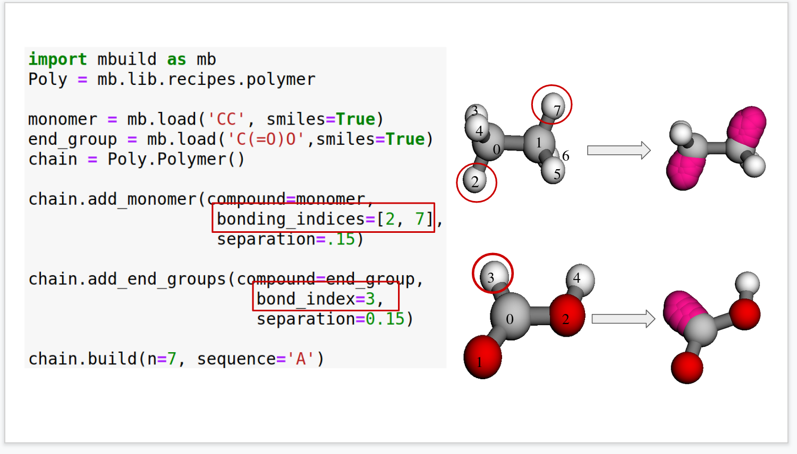

Building a Simple Alkane
========================

The purpose of this tutorial is to demonstrate the construction of an
alkane polymer and provide familiarity with many of the underlying
functions in mBuild. Note that a robust polymer construction recipe
already exists in mBuild, which will also be demonstrated at the end of
the tutorial.

Setting up the monomer
----------------------

The first step is to construct the basic repeat unit for the alkane,
i.e., a :math:`CH_2` group, similar to the construction of the
:math:`CH_3` monomer in the prior methane tutorial. Rather than
importing the coordinates from a pdb file, as in the previous example,
we will instead explicitly define them in the class. Recall that
distance units are nm in mBuild.

.. code:: ipython3

    import mbuild as mb

    class CH2(mb.Compound):
        def __init__(self):
            super(CH2, self).__init__()
            # Add carbon
            self.add(mb.Particle(name='C', pos=[0,0,0]), label='C[$]')

            # Add hydrogens
            self.add(mb.Particle(name='H', pos=[-0.109, 0, 0.0]), label='HC[$]')
            self.add(mb.Particle(name='H', pos=[0.109, 0, 0.0]), label='HC[$]')

            # Add bonds between the atoms
            self.add_bond((self['C'][0], self['HC'][0]))
            self.add_bond((self['C'][0], self['HC'][1]))

            # Add ports anchored to the carbon
            self.add(mb.Port(anchor=self[0]), label='up')
            self.add(mb.Port(anchor=self[0]), label='down')

            # Move the ports approximately half a C-C bond length away from the carbon
            self['up'].translate([0, -0.154/2, 0])
            self['down'].translate([0, 0.154/2, 0])

    monomer = CH2()
    monomer.visualize(show_ports=True)

This configuration of the monomer is not a particularly realistic
conformation. One could use this monomer to construct a polymer and then
apply an energy minimization scheme, or, as we will demonstrate here, we
can use mBuild’s rotation commands to provide a more realistic starting
point.

Below, we use the same basic script, but now apply a rotation to the
hydrogen atoms. Since the hydrogens start 180° apart and we know they
should be ~109.5° apart, each should be rotated half of the difference
closer to each other around the y-axis. Note that the rotation angle is
given in radians. Similarly, the ports should be rotated around the
x-axis by the same amount so that atoms can be added in a realistic
orientation.

.. code:: ipython3

    import numpy as np
    import mbuild as mb

    class CH2(mb.Compound):
        def __init__(self):
            super(CH2, self).__init__()
            # Add carbon
            self.add(mb.Particle(name='C', pos=[0,0,0]), label='C[$]')

            # Add hydrogens
            self.add(mb.Particle(name='H', pos=[-0.109, 0, 0.0]), label='HC[$]')
            self.add(mb.Particle(name='H', pos=[0.109, 0, 0.0]), label='HC[$]')

            # Rotate the hydrogens
            theta = 0.5 * (180 - 109.5) * np.pi / 180
            #mb.rotate(self['HC'][0], theta, around=[0, 1, 0])
            #mb.rotate(self['HC'][1], -theta, around=[0, 1, 0])
            self['HC'][0].rotate( theta, around=[0, 1, 0])
            self['HC'][1].rotate(-theta, around=[0, 1, 0])

            # Add bonds between the atoms
            self.add_bond((self['C'][0], self['HC'][0]))
            self.add_bond((self['C'][0], self['HC'][1]))

            # Add the ports and appropriately rotate them
            self.add(mb.Port(anchor=self[0]), label='up')
            self['up'].translate([0, -0.154/2, 0])
            self['up'].rotate(theta, around=[1, 0, 0])

            self.add(mb.Port(anchor=self[0]), label='down')
            self['down'].translate([0, 0.154/2, 0])
            self['down'].rotate(-theta, around=[1, 0, 0])

    monomer = CH2()
    monomer.visualize(show_ports=True)

Defining the polymerization class
---------------------------------

With a basic monomer construct, we can now construct a polymer by
connecting the ports together. Here, we first instantiate one instance
of the CH2 class as ``1ast_monomer``, then use the clone function to
make a copy. The ``force_overlap()`` function is used to connect the
``'up'`` port from ``current_monomer`` to the ``'down'`` port of
``last_mononer``.

.. code:: ipython3

    class AlkanePolymer(mb.Compound):
        def __init__(self):
            super(AlkanePolymer, self).__init__()
            last_monomer = CH2()
            self.add(last_monomer)
            for i in range(3):
                current_monomer = CH2()
                mb.force_overlap(move_this=current_monomer,
                                 from_positions=current_monomer['up'],
                                 to_positions=last_monomer['down'])
                self.add(current_monomer)
                last_monomer = current_monomer

    polymer = AlkanePolymer()
    polymer.visualize(show_ports=True)

Visualization of this structure demonstrates a problem; the polymer
curls up on itself. This is a result of the fact that ports not only
define the location in space, but also an orientation. This can be
trivially fixed, by rotating the down port 180° around the y-axis.

We can also add a variable ``chain_length`` both to the for loop and
``init`` that will allow the length of the polymer to be adjusted when
the class is instantiated.

.. code:: ipython3

    import numpy as np
    import mbuild as mb

    class CH2(mb.Compound):
        def __init__(self):
            super(CH2, self).__init__()
             # Add carbons and hydrogens
            self.add(mb.Particle(name='C', pos=[0,0,0]), label='C[$]')
            self.add(mb.Particle(name='H', pos=[-0.109, 0, 0.0]), label='HC[$]')
            self.add(mb.Particle(name='H', pos=[0.109, 0, 0.0]), label='HC[$]')

            # rotate hydrogens
            theta = 0.5 * (180 - 109.5) * np.pi / 180
            self['HC'][0].rotate(theta, around=[0, 1, 0])
            self['HC'][1].rotate(-theta, around=[0, 1, 0])

            # Add bonds between the atoms
            self.add_bond((self['C'][0], self['HC'][0]))
            self.add_bond((self['C'][0], self['HC'][1]))

            # Add ports
            self.add(mb.Port(anchor=self[0]), label='up')
            self['up'].translate([0, -0.154/2, 0])
            self['up'].rotate(theta, around=[1, 0, 0])

            self.add(mb.Port(anchor=self[0]), label='down')
            self['down'].translate([0, 0.154/2, 0])
            self['down'].rotate(np.pi, [0, 1, 0])
            self['down'].rotate(-theta, around=[1, 0, 0])

    class AlkanePolymer(mb.Compound):
        def __init__(self, chain_length=1):
            super(AlkanePolymer, self).__init__()
            last_monomer = CH2()
            self.add(last_monomer)
            for i in range (chain_length-1):
                current_monomer = CH2()

                mb.force_overlap(move_this=current_monomer,
                                 from_positions=current_monomer['up'],
                                 to_positions=last_monomer['down'])
                self.add(current_monomer)
                last_monomer=current_monomer

.. code:: ipython3

    polymer = AlkanePolymer(chain_length=10)
    polymer.visualize(show_ports=True)

Using mBuild’s Polymer Class
----------------------------

``mBuild`` provides a prebuilt class to perform this basic
functionality. Since it is designed to be more general, it takes as an
argument not just the replicates (``n``), ``sequence`` ('A' for a single monomer or 'AB' for two different monomers).
Then, it binds them together by removing atom/bead via specifying its index number (``indices``).
A graphical description of the polymer builder creating ports, then bonding them together is provided below.

    **Polymer builder class example.** This shows how to define the atoms, which are replaced with ports.  The ports are then bonded together between the monomers.  Additionally, these ports can be utilized for adding different end groups moieties to the polymer.

.. note::
    The port locations may be critical to ensure the molecule is not overlapping when it is built.

Building a Simple Hexane
----------------------------
A simple hexane molecule is built using ``mBuild``'s packaged polymer builder.
This is done by loading a methane molecule via a SMILES string.
The indices are explicitly selected, so the molecule builds out in the proper directions and does not overlap.

.. code:: ipython3

    import mbuild as mb
    from mbuild.lib.recipes.polymer import Polymer

    comp = mb.load('C', smiles=True) # mBuild compound of the monomer unit
    chain = Polymer()

    chain.add_monomer(compound=comp,
                      indices=[1, -2],
                      separation=.15,
                      replace=True)

    chain.build(n=6, sequence='A')

Using Multiple Monomers and Capping the Ends of a Polymer
---------------------------------------------------------
This example uses methyl ether and methane monomers to build a polymer, capping it with fluorinated and alcohol end groups.
The monomers are combined together in the 'AB' sequence two times (n=2), which means the polymer will contain 2 of each monomer (ABAB).
The end groups are added via the ``add_end_groups`` attribute, specifying the atom to use (``index``), the distance of the bond (``separation``),
the location of each end group (``label``), and if the tail end group is duplicated to the head of the polymer (``duplicate``).
The indices are explicitly selected, so the molecule builds out in the proper directions and does not overlap.

.. code:: ipython3

    from mbuild.lib.recipes.polymer import Polymer
    import mbuild as mb

    comp_1 = mb.load('C', smiles=True)
    comp_2 = mb.load('COC', smiles=True)
    chain = Polymer()

    chain.add_monomer(compound=comp_1,
                      indices=[1, -1],
                      separation=.15,
                      replace=True)

    chain.add_monomer(compound=comp_2,
                      indices=[3, -1],
                      separation=.15,
                      replace=True)

    chain.add_end_groups(mb.load('O',smiles=True), # Capping off this polymer with an Alcohol
                         index=1,
                         separation=0.15, label="head", duplicate=False)

    chain.add_end_groups(mb.load('F',smiles=True), # Capping off this polymer with a Fluorine
                         index=1,
                         separation=0.18, label="tail", duplicate=False)

    chain.build(n=2, sequence='AB')
    chain.visualize(show_ports=True)

Building a System of Alkanes
----------------------------

A system of alkanes can be constructed by simply cloning the polymer
constructed above and translating and/or rotating the alkanes in space.
``mBuild`` provides many routines that can be used to create different
patterns, to which the polymers can be shifted.

.. code:: ipython3

    comp = mb.load('C', smiles=True) # mBuild compound of the monomer unit
    polymer = Polymer()

    polymer.add_monomer(compound=comp,
                        indices=[1, -2],
                        separation=.15,
                        replace=True)

    polymer.build(n=10, sequence='A')

    # the pattern we generate puts points in the xy-plane, so we'll rotate the polymer
    # so that it is oriented normal to the xy-plane
    polymer.rotate(np.pi/2, [1, 0, 0])

    # define a compound to hold all the polymers
    system = mb.Compound()

    # create a pattern of points to fill a disk
    # patterns are generated between 0 and 1,
    # and thus need to be scaled to provide appropriate spacing
    pattern_disk = mb.DiskPattern(50)
    pattern_disk.scale(5)

    # now clone the polymer and move it to the points in the pattern
    for pos in pattern_disk:
        current_polymer = mb.clone(polymer)
        current_polymer.translate(pos)
        system.add(current_polymer)

    system.visualize()

Other patterns can be used, e.g., the ``Grid3DPattern``. We can also use
the rotation commands to randomize the orientation.

.. code:: ipython3

    import random

    comp = mb.load('C', smiles=True)
    polymer = Polymer()

    polymer.add_monomer(compound=comp,
                        indices=[1, -2],
                        separation=.15,
                        replace=True)

    polymer.build(n=10, sequence='A')

    system = mb.Compound()
    polymer.rotate(np.pi/2, [1, 0, 0])

    pattern_disk = mb.Grid3DPattern(5, 5, 5)
    pattern_disk.scale(8.0)

    for pos in pattern_disk:
        current_polymer = mb.clone(polymer)
        for around in [(1, 0, 0), (0, 1, 0), (0, 0, 1)]:  # rotate around x, y, and z
            current_polymer.rotate(random.uniform(0, np.pi), around)
        current_polymer.translate(pos)
        system.add(current_polymer)

    system.visualize()

``mBuild`` also provides an interface to ``PACKMOL``, allowing the
creation of a randomized configuration.

.. code:: ipython3

    comp = mb.load('C', smiles=True) # mBuild compound of the monomer unit
    polymer = Polymer()

    polymer.add_monomer(compound=comp,
                        indices=[1, -2],
                        separation=.15,
                        replace=True)

    polymer.build(n=5, sequence='A')

    system = mb.fill_box(polymer, n_compounds=100, overlap=1.5, box=[10,10,10])
    system.visualize()

Variations
----------

Rather than a linear chain, the ``Polymer`` class we wrote can be easily
changed such that small perturbations are given to each port. To avoid
accumulation of deviations from the equilibrium angle, we will clone an
unperturbed monomer each time (i.e., ``monomer_proto``) before applying
a random variation.

We also define a variable ``delta``, which will control the maximum
amount of perturbation. Note that large values of ``delta`` may result
in the chain overlapping itself, as ``mBuild`` does not currently
include routines to exclude such overlaps.

.. code:: ipython3

    import mbuild as mb

    import random

    class AlkanePolymer(mb.Compound):
        def __init__(self, chain_length=1, delta=0):
            super(AlkanePolymer, self).__init__()
            monomer_proto = CH2()
            last_monomer = CH2()
            last_monomer['down'].rotate(random.uniform(-delta,delta), [1, 0, 0])
            last_monomer['down'].rotate(random.uniform(-delta,delta), [0, 1, 0])
            self.add(last_monomer)
            for i in range(chain_length-1):
                current_monomer = mb.clone(monomer_proto)
                current_monomer['down'].rotate(random.uniform(-delta,delta), [1, 0, 0])
                current_monomer['down'].rotate(random.uniform(-delta,delta), [0, 1, 0])
                mb.force_overlap(move_this=current_monomer,
                                 from_positions=current_monomer['up'],
                                 to_positions=last_monomer['down'])
                self.add(current_monomer)
                last_monomer=current_monomer

    polymer = AlkanePolymer(chain_length = 200, delta=0.4)
    polymer.visualize()
