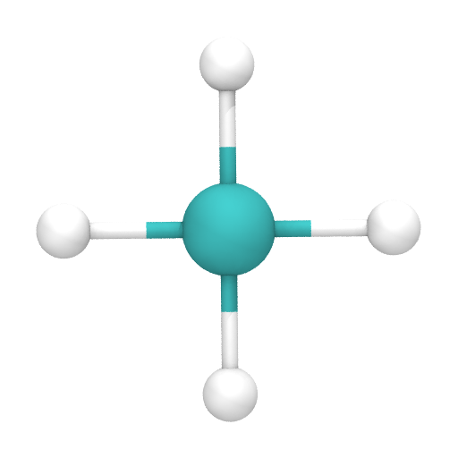
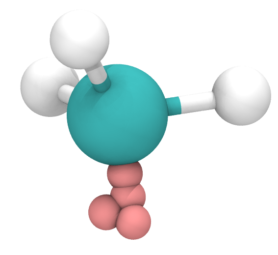

Tutorials
=========

Methane: Atoms, Bonds and Compounds
-----------------------------------
In this example, we'll cover the core classes that make up an mBuild structure
by building a methane molecule.

The primary building block in mBuild is a ``Compound``. Anything you construct
will inherit from this class. Let's start with some basic imports and
initialization::

    from mbuild.compound import Compound

    class Methane(Compound):
        def __init__(self):
            super(Methane, self).__init__()

.. note:: The use of the ``super()`` method is required here to resolve
          ``Compound``'s `multiple inheritance <http://stackoverflow.com/questions/3277367/how-does-pythons-super-work-with-multiple-inheritance>`_
          from the ``MBase``, ``PartMixin`` and ``HasPartsMixin`` classes.

The other parts used in building molecules are ``Atoms`` and ``Bonds``. Either of
them can be added to a ``Compound`` using its ``add()`` method. Let's add a carbon
and a hydrogen atom to our ``Methane`::

    from mbuild.compound import Compound
    from mbuild.atom import Atom
    from mbuild.bond import Bond

    class Methane(Compound):
        def __init__(self):
            super(Methane, self).__init__()
            carbon = Atom(kind='C')
            self.add(carbon)

            hydrogen = Atom(kind='H', pos=[0.15, 0, 0])
            self.add(hydrogen, label='hc[$]')

By default a created ``Atom`` will be placed at ``0, 0, 0`` as indicated by its
``pos`` attribute. All positions in mBuild are stored in nanometers. The
``Atom`` objects contained in a ``Compound`` can be referenced via the
``atoms`` attribute which returns a list of all ``Atoms`` including those
in any sub-compounds.

Any part added to a ``Compound`` can be given an optional, descriptive string
label. If the label ends with the characters ``[$]``, a list will be created
in the labels. Any subsequent parts added to the ``Compound`` with the same
label prefix will be appended to the list. In the example above, we've labeled
the hydrogen as ``hc[$]``. So this first part, with the label prefix ``hc``, is
now referenceable via ``self.hc[0]``. The next part added with the label ``hc[$]``
will be referenceable via ``self.hc[1]``.

Now let's use these styles of referencing to connect the carbon to the hydrogen::

    from mbuild.compound import Compound
    from mbuild.atom import Atom
    from mbuild.bond import Bond

    class Methane(Compound):
        def __init__(self):
            super(Methane, self).__init__()
            carbon = Atom(kind='C')
            self.add(carbon)

            hydrogen = Atom(kind='H', pos=[0.15, 0, 0])
            self.add(hydrogen, label='hc[$]')

            ch_bond = Bond(self.atoms[0], self.hc[0])
            self.add(ch_bond)

As you can see, the carbon is placed in the zero index of the ``atoms`` attribute.
The hydrogen could be referenced via ``self.atoms[1]`` but since we gave it a
fancy label, it's also referenceable via ``hc[0]``.

Like ``Atoms``, ``Bonds`` also have a descriptive ``kind`` attribute. By default,
``kind`` is set to ``'{0}-{1}'.format(atom1.kind, atom2.kind)``.

Alright now that we've got the basics, let's finish building our ``Methane`` and
take a look at it::

     from mbuild.compound import Compound
     from mbuild.atom import Atom
     from mbuild.bond import Bond

     class Methane(Compound):
         def __init__(self):
             super(Methane, self).__init__()
             carbon = Atom(kind='C')
             self.add(carbon)

             hydrogen = Atom(kind='H', pos=[0.15, 0, 0])
             self.add(hydrogen, label='hc[$]')

             ch_bond = Bond(self.atoms[0], self.hc[0])
             self.add(ch_bond)

             self.add(Atom(kind='H', pos=[0, 0.15, 0]), 'hc[$]')
             self.add(Bond(self.atoms[0], self.hc[1]))
             self.add(Atom(kind='H', pos=[-0.15, 0, 0]), 'hc[$]')
             self.add(Bond(self.atoms[0], self.hc[2]))
             self.add(Atom(kind='H', pos=[0, -0.15, 0]), 'hc[$]')
             self.add(Bond(self.atoms[0], self.hc[3]))

     if __name__ == "__main__":
          methane = Methane()
          methane.visualize()

     A methane molecule.

.. note:: The ``visualize()`` method currently invokes a very primative call to
          VMD from the command-line. If it fails for you but you do have VMD
          installed, the method works by writing an intermediate output file
          named ``visualize_Methane.pdb`` which you can load yourself. We are
          currently working on creating a more robust and useful interface VMD
          but any help would be appreciated (see issue #32).

Ethane: Reading from files, Ports and coordinate transforms
-----------------------------------------------------------

In this example, we'll cover reading molecular components from files, introduce
the concept of ``Ports`` and start using some coordinate transforms.

As you probably noticed while creating your methane mocule in the last tutorial,
manually adding ``Atoms`` and ``Bonds`` to a ``Compound`` is a bit cumbersome.
The easiest way to create small, reusable components, such as methyls, amines or
monomers, is to hand draw them using software like `Avogadro <http://avogadro.cc/wiki/Main_Page>`_
and export them as either a .pdb or .mol2 file (the file should contain
connectivity information).

Let's start by reading a methyl group from a .pdb file::

    from mbuild.compound import Compound
    from mbuild.testing.tools import get_fn

    class Methyl(Compound):
        def __init__(self):
            super(Methyl, self).__init__(self)

            self.append_from_file(get_fn('methyl.pdb'))

.. note:: The ``get_fn()`` function will look up a file name in
``mbuild/testing/reference`` where we keep all of the systems we use for testing.
This is purely a convenience function that we heartlessly copied from the
developers of MDTraj.

Now let's use our first coordinate transform to center the methyl at its carbon
atom::

    from mbuild.compound import Compound
    from mbuild.testing.tools import get_fn
    from mbuild.coordinate_transform import translate

    class Methyl(Compound):
        def __init__(self):
            super(Methyl, self).__init__(self)

            self.append_from_file(get_fn('methyl.pdb'))

            translate(self, -self.C[0])

Note here that when referring to the ``Atom`` object in a mathematical
expression, we operate directly on its coordinates. This functionality is
currently implemented for addition and subtraction only.

So now we have a methyl group loaded up and centered. In order to connect
``Compounds`` in mBuild, we make use of a special type of ``Compound``: the ``Port``.
A ``Port`` is a ``Compound`` with four "ghost" ``Atoms`` (of type 'G' by convention).
In addition ``Ports`` have an ``anchor`` attribute which typically points to an
``Atom`` that the ``Port`` should be associated with. In our methyl group, the
``Port`` should be anchored to the carbon atom so that we can now form ``Bonds``
to this carbon::

    from mbuild.compound import Compound
    from mbuild.testing.tools import get_fn
    from mbuild.coordinate_transform import translate
    from mbuild.port import Port

    class Methyl(Compound):
        def __init__(self):
            super(Methyl, self).__init__(self)

            self.append_from_file(get_fn('methyl.pdb'))

            translate(self, -self.C[0])

            self.add(Port(anchor=self.C[0]), 'up')

By default, ``Ports`` are created to point in the y-direction. Typically,
``Ports`` should point in the direction of the ``Bond`` we want to create.
Since the methyl group is already oriented towards the y-direction, let's simply
move the port a tiny bit away from the carbon::

    import numpy as np

    from mbuild.compound import Compound
    from mbuild.port import Port
    from mbuild.coordinate_transform import translate
    from mbuild.testing.tools import get_fn

    class Methyl(Compound):
        def __init__(self):
            super(Methyl, self).__init__(self)

            self.append_from_file(get_fn('methyl.pdb'))

            translate(self, -self.C[0])

            self.add(Port(anchor=self.C[0]), 'down')
            translate(self.down, np.array([0, -0.07, 0]))

    if __name__ == '__main__':
        methyl = Methyl()
        methyl.visualize(show_ports=True)

     A methyl group with one ``Port``.

By default, ``Ports`` are never output from the mBuild structure. However,
it can be useful to look at a molecule with the ``Ports`` to check your work as
you go. The default VMD settings don't show ports where well so let's change
the representation style to small vdW spheres:

When two ``Ports`` are connected, they are forced to overlap in space and their
parent ``Compounds`` are rotated and translated by the same amount. If we tried
to connect two of our ``Methyls`` right now, not only would the ``Ports`` overlap
perfectly, but the carbons and hydrogens would also perfectly overlap. What we
need is a second ``Port`` facing the opposite direction.

.. note:: By convention, we try to label ``Ports`` successively as 'down', 'up',
'left', 'right', 'front', 'back' which should roughly correspond to the relative
directions that they face. Additionally, when we attach ``Ports`` to surfaces,
we try to make them point upward or outward and label these as ``up``. This is a
bit tricky to enforce because the system is so flexible so use your best judgement
and try to be consistent! The more components we collect in our library with the
same labeling conventions, the easier it becomes to build ever more complex
structures.

So let's add that second ``Port`` facing in the opposite direction so that we
can attach the ``Methyl`` *to* and *from* other ``Compounds``::

    from numpy import pi

    from mbuild.compound import Compound
    from mbuild.port import Port
    from mbuild.coordinate_transform import rotate_around_z, translate
    from mbuild.testing.tools import get_fn

    class Methyl(Compound):
        def __init__(self):
            super(Methyl, self).__init__(self, kind='methyl')

            self.append_from_file(get_fn('methyl.pdb'))

            translate(self, -self.C[0])

            self.add(Port(anchor=self.C[0]), 'down')
            translate(self.down, [0, -0.07, 0])

            self.add(Port(anchor=self.C[0]), 'up')
            rotate_around_z(self.up, pi)
            translate(self.down, [0, -0.07, 0])

Now the fun part: Stick 'em together to create an ethane::

    from mbuild.compound import Compound
    from mbuild.examples.ethane.methyl import Methyl
    from mbuild.coordinate_transform import equivalence_transform

    class Ethane(Compound):
        def __init__(self):
            super(Ethane, self).__init__(kind='ethane')

            self.add(Methyl(), "m1")
            self.add(Methyl(), "m2")
            equivalence_transform(self.m1, self.m1.up, self.m2.down)

    if __name__ == '__main__':
        ethane = Ethane()
        ethane.visualize()

.. figure:: images/ethane.png
    :align: center
    :scale: 50%
    :alt: Ethane with all Ports shown.

     An ethane molecule with all four ``Ports`` shown overlapping.

The ``equivalence_transform()`` function takes a ``Compound`` and then rotates
and translates it such that two other ``Compounds`` overlap. Typically, as in
this case, those two other ``Compounds`` are ``Ports``.

Monolayer: Complex hierarchies, masks, tiling and writing to files
------------------------------------------------------------------

Write-up coming soon! See ``mbuild/examples/alkane_monolayer`` to take a look yourself.

