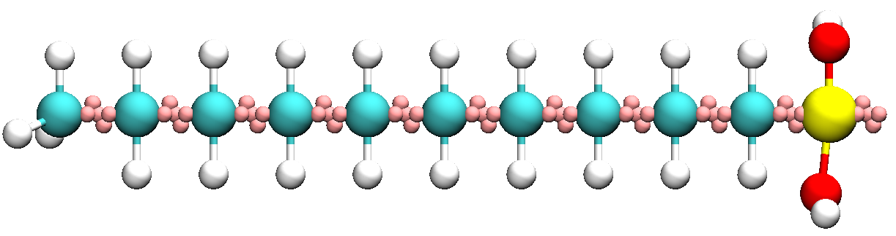
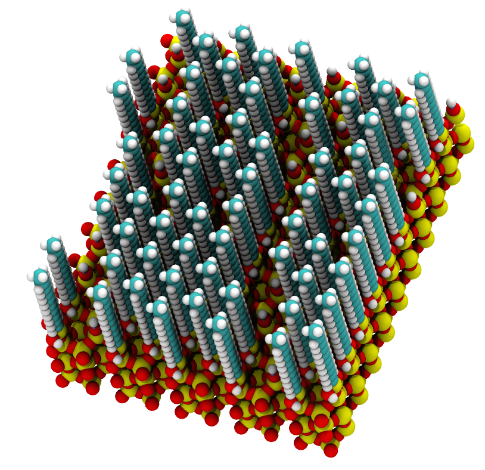

Monolayer: Complex hierarchies, masks, tiling and writing to files
------------------------------------------------------------------

In this example, we'll cover assembling more complex hierarchies of components
using masks, tiling and how to output systems to files. To illustrate these
concepts, let's build an alkane monolayer on a crystalline substrate.

First, let's build our monomers and functionalized them with a silane group
which we can then attach to the substrate::

    from mbuild.compound import Compound

    from mbuild.examples.alkane.alkane import Alkane
    from mbuild.components.small_groups.silane import Silane

    class AlkylSilane(Compound):
        """A silane functionalized alkane chain with one Port. """
        def __init__(self, chain_length):
            super(AlkylSilane, self).__init__()

            alkane = Alkane(chain_length, cap_end=False)
            self.add(alkane, 'alkane')
            silane = Silane()
            self.add(silane, 'silane')
            equivalence_transform(self.alkane, self.alkane.down, self.silane.up)

            # Hoist silane port to AlkylSilane level.
            self.add(silane.down, 'down', containment=False)

The ``Alkane`` example uses the ``polymer`` tool to combine ``Ch2`` and ``Ch3`` repeat
units. You also have the option to cap the front and back of the chain or to
leave a ``Ch2`` group with a dangling port. The ``Silane`` compound is a |Si(OH)2|
group with two ports facing out from the central Si. Lastly, we combine
``alkane`` with ``silane`` and hoist the last free port from the
lower compounds so that we can reference it later.

Now let's create a substrate to which we can later attach our monomers::

    from mbuild.tools.tiled_compound import TiledCompound
    from mbuild.components.surfaces.betacristobalite import Betacristobalite

    surface = Betacristobalite()
    tiled_surface = TiledCompound(surface, n_tiles=(2, 3, 1), kind="tiled_surface")

Here we've imported a beta-cristobalite surface from our component library.
The ``TiledCompound`` tool allows you replicate any `Compound` in the x-, y-
and z-directions by any number of times - 2, 3 and 1 for our case.

Next, let's import our monomers and a hydrogen atom that we'll place on
unoccupied surface sites::

    from .alkylsilane import AlkylSilane
    from mbuild.components.atoms.H import H
    alkylsilane = AlkylSilane(chain_length)
    hydrogen = H()

Then we need to tell mBuild how to arrange the chains on the surface. This is
accomplished with the "mask" tools. Every mask provided in ``tools.mask``
is just a collection of points. There are all kinds of masks like spherical, 2D,
regular, irregular etc. When you use the ``apply_mask`` command, you effectively
superimpose the mask onto the host compound, mBuild figures out what the closest
ports are to the mask points and then attach copies of the guest onto the
binding sites identified by the mask::

    from mbuild.tools.mask import grid_mask_2d
    mask = grid_mask_2d(8, 8)  # Evenly spaced, 2D grid of points.

    # Attach chains to specified binding sites. Other sites get a hydrogen.
    apply_mask(host=tiled_surface, guest=alkylsilane, mask=mask, backfill=hydrogen)

Also note the ``backfill`` optional argument which allows you to place a different
compound on any unused ports. In this case we want to backfill with hydrogen
atoms on every port without a chain.

And that's it! Check out ``examples.alkane_monolayer`` for the fully wrapped
class.

.. |Si(OH)2| replace:: Si(OH)\ :sub:`2`\
